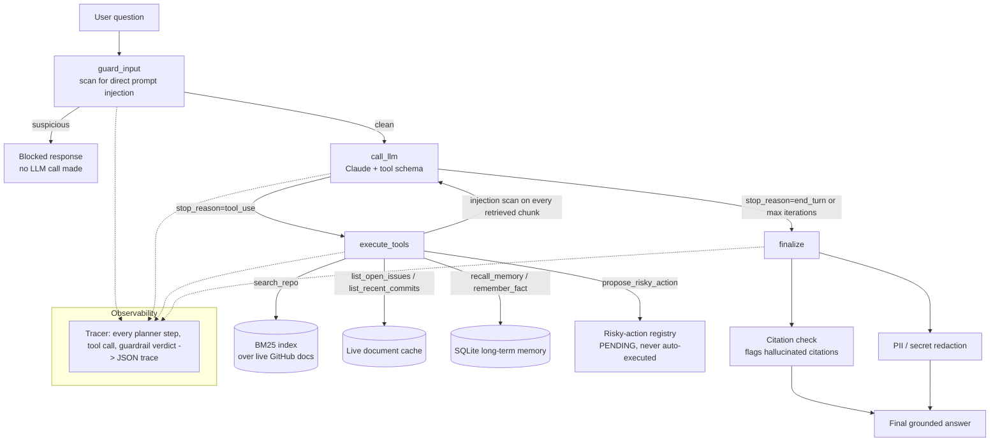

# SentinelRAG

**Agentic RAG over a live GitHub repo, with cross-session memory, guardrails against prompt injection, and a CI-gated evaluation suite.**

Most "chat with your PDF" RAG projects answer questions against a static snapshot of documents. SentinelRAG instead answers questions against a repo's *live* issues, pull requests, and commits — "what changed this quarter, and what looks like a risk?" — by planning its own tool calls, citing every claim, defending itself against instructions smuggled into the data it retrieves, and proving all of that with a labeled evaluation suite that runs on every push instead of a claim in a README.

This project deliberately combines two ideas that are usually built (and demoed) separately:

1. **Agentic RAG over live data + memory** — a LangGraph tool-calling loop, not a single retrieve-then-generate pass.
2. **Guardrails + evals in CI** — the difference between a demo and something you'd trust in production.

## Why this, not another PDF chatbot

A retrieval-augmented chatbot over a static PDF has become the default portfolio project — thousands of students have built the exact one this project's own inspiration video calls out. What actually differentiates a resume for AI/agentic roles isn't "I called an LLM API," it's whether the system is *measurable*, *recoverable*, and *safe*: can it evaluate its own retrieval quality, recover from a failing tool call, explain why it needed multiple steps, defend against prompt injection, and trace exactly what happened when it produces a bad answer? Every one of those questions has a concrete, testable answer in this repo — not a paragraph asserting it.

## Architecture



The loop is a real cycle, not a straight line: the model decides for itself how many tool calls it needs — search issues, then commits, then check memory — before it has enough evidence, bounded by a hard `MAX_ITERATIONS` so a confused model can't loop forever.

### Component map

| Concern | Where | Notes |
|---|---|---|
| Live data | `sentinelrag/connectors/github.py` | Refreshes from the GitHub REST API on demand; falls back to the last good cache if the API rate-limits or is unreachable, rather than crashing the pipeline. |
| Retrieval | `sentinelrag/retrieval/` | BM25 (lexical), with three swappable chunking strategies measured against each other, not just one assumed to be best. |
| Memory | `sentinelrag/memory/store.py` | SQLite, one row per `(repo, key)`, upserted — durable facts persist across sessions without growing unboundedly. |
| Orchestration | `sentinelrag/agents/graph.py` | LangGraph state machine: `guard_input → call_llm ⇄ execute_tools → finalize`. |
| Tools | `sentinelrag/tools/repo_tools.py` | `search_repo`, `list_open_issues`, `list_recent_commits`, `recall_memory`, `remember_fact`, `propose_risky_action`. |
| Guardrails | `sentinelrag/guardrails/` | Injection detection (direct + indirect), citation verification, PII/secret redaction, a risky-action gate that requires human confirmation. |
| Observability | `sentinelrag/tracing/tracer.py` | Every step logged to a structured JSON trace; `scripts/view_trace.py` renders it. |
| Evaluation | `evals/` | Deterministic guardrail + retrieval evals (CI-gated, no API key needed) and an optional live end-to-end eval against the real API. |

## The guardrails, specifically

- **Direct prompt injection** — the user's own query is scanned before it ever reaches the model (`guard_input`). A match short-circuits the graph; the LLM is never called.
- **Indirect prompt injection** — every chunk of retrieved evidence is scanned too, because on a public repo *anyone* can open an issue, and an issue body is exactly where an attacker would plant "ignore previous instructions." The system prompt also explicitly tells the model tool results are untrusted data, never instructions — defense in depth, not just one layer.
- **Citation verification** — the model is required to cite `[issue:N]` / `[pull_request:N]` / `[commit:sha]` for every claim. After generation, every citation is checked against the set of citations the model actually saw from tool calls. A citation that wasn't in the evidence is flagged as hallucinated — mechanically, not by trusting the model's word.
- **PII / secret redaction** — the final answer is scanned for emails, GitHub tokens, AWS keys, generic API keys, phone numbers, and IPs before it's returned, since verbatim-quoted issue text can legitimately contain these.
- **Risky-action confirmation** — the agent can *propose* a write action (closing an issue, merging a PR) via `propose_risky_action`, but nothing executes it. It sits in a `RiskyActionRegistry` in `PENDING` status until a human calls `.confirm()`. This is enforced as a code boundary, not a prompt instruction an injected issue body could try to talk the model out of.
- **Hard iteration cap** — `MAX_ITERATIONS = 6` bounds the tool-calling loop regardless of what the model wants to do next; a test (`test_loop_terminates_at_max_iterations...`) proves this holds even when the model is scripted to request tools forever.

## Measured results

These are real numbers from `evals/run_deterministic_evals.py`, generated against the labeled datasets in `evals/datasets/` — re-run it yourself, it takes under a second and needs no API key:

| Metric | Result | Dataset |
|---|---|---|
| Prompt injection detection (precision / recall / F1) | **0.889 / 1.000 / 0.941** | 18 labeled examples (direct + indirect, incl. adversarial issue bodies) |
| PII/secret redaction category recall | **1.00** | 8 labeled examples across 6 categories |
| Citation-hallucination detection accuracy | **1.00** | 5 labeled answer/evidence pairs |
| Retrieval hit-rate@1, `whole_document` chunking | **0.958** | 24 QA pairs over a 20-document synthetic repo |
| Retrieval hit-rate@1, `fixed_400` chunking | **0.917** | same 24 QA pairs |

That last row is the concrete "I compared chunking strategies and measured the difference" result the eval harness exists to produce: on issues with a long body (a root-cause explanation buried a few hundred characters in, not in the title), splitting into fixed 400-character windows loses ~4 points of hit-rate@1 versus keeping each issue/PR/commit whole, because the answer-bearing sentence sometimes lands in the "wrong" chunk. At hit-rate@3, all three strategies saturate to 1.00 on a corpus this size — worth knowing before assuming top-3 hides the difference at any scale.

Run `python evals/run_deterministic_evals.py` yourself to regenerate `evals/results/deterministic_results.json` with full detail, including which specific examples the injection/PII classifiers got wrong.

**Unit test coverage:** 37 tests, 100% pass, **93%** line coverage of the testable surface (`sentinelrag/cli.py`'s interactive loop and the real Anthropic API adapter are intentionally excluded — they're exercised manually against a live key, not mocked in CI).

**A real bug this caught:** the first version of `execute_tools()` only harvested valid citations from `search_repo`'s output, keyed specifically on its `"results"` field. That passed all 36 unit tests, because every test happened to route through `search_repo`. Running the live agent for the first time against `langchain-ai/langgraph` immediately surfaced the bug: the model reasonably chose `list_recent_commits` and `list_open_issues` instead, and every single citation it produced got flagged as "hallucinated" — a false positive in the guardrail itself, from a fully mocked test suite reporting green. Fixed by harvesting citations from *any* tool's output rather than one hardcoded key, with a regression test added (`test_citations_from_non_search_tools_are_not_flagged_as_hallucinated`). This is the concrete answer to "how do you know your mocked tests are actually representative": you don't, until you run the real thing at least once, and you write down what it caught.

An optional **end-to-end eval against the real API and a real live repo** (`evals/run_live_eval.py`) is documented below — it's not run in CI since it needs `ANTHROPIC_API_KEY`, network, and burns tokens, but running it locally is one command and the resulting latency/citation-accuracy numbers are worth pasting in here after your own run.

## CI

`.github/workflows/ci.yml` runs on every push and PR to `main`:

1. Install deps, run all 36 unit tests with coverage.
2. Run the deterministic eval suite and **fail the build** if any headline metric (injection F1, PII recall, citation accuracy, best retrieval hit-rate) drops below `0.75`.
3. Upload `evals/results/deterministic_results.json` as a build artifact and write it into the job summary.

No secrets required — this is the whole point of splitting deterministic (rule-based, mockable-LLM) evals from the optional live end-to-end eval.

## Getting started

```bash
git clone <this-repo>
cd sentinelrag
python -m venv .venv && source .venv/bin/activate
pip install -r requirements.txt

cp .env.example .env
# fill in ANTHROPIC_API_KEY (required to actually run the agent)
# GITHUB_TOKEN is optional -- raises the GitHub API rate limit from 60/hr to 5000/hr

# Run the deterministic test + eval suite (no API key needed):
pytest tests/ -v
python evals/run_deterministic_evals.py

# Ask the live agent a question about a real repo:
python -m sentinelrag.cli --repo langchain-ai/langgraph "What changed recently, and are there any open blockers?"

# Optional: full end-to-end eval against the real API
python evals/run_live_eval.py --repo langchain-ai/langgraph

# Inspect exactly what the agent did on any run:
python scripts/view_trace.py data/traces/<run_id>.json
```

## Design trade-offs (the story, for interviews)

- **BM25 over dense embeddings.** The whole retrieval pipeline runs offline, deterministically, and for $0 — anyone cloning this repo can run the eval suite with zero setup and zero API cost. The trade-off is real and measured: BM25 is lexical, so a paraphrased query with no shared vocabulary with the evidence will miss. A dense/hybrid retriever is the natural next step, and the retrieval layer is already isolated behind `BM25Index` specifically so it can be swapped without touching the agent graph.
- **A hand-rolled tracer instead of LangSmith.** This keeps the demo runnable without a paid account or extra API key, and every event funnels through one `Tracer.log_event()` call, so swapping in LangSmith/OpenTelemetry later is a one-file change — itself a point worth making about designing the observability seam before you need it.
- **Rule-based injection detection as layer one, not the only layer.** A regex/heuristic classifier has zero latency and zero cost, is fully unit-testable without an API key, and — critically — can't itself be prompt-injected. It won't catch every creative phrasing; an LLM-based classifier is the natural layer two, deliberately left as documented future work rather than claimed as done.
- **Why multiple tools instead of one big "answer" call.** `search_repo`, `list_open_issues`, `list_recent_commits`, `recall_memory`, and `remember_fact` are separate tools so the model's *plan* is legible in the trace — you can see it decide "check open issues, then check if this was already fixed in a recent commit" as two distinct, inspectable steps, instead of one opaque generation.
- **Why a risky-action registry instead of just prompting the model not to take actions.** A prompt instruction is exactly what indirect injection targets. Making "propose vs. execute" a hard code boundary means even a fully successful injection can only get as far as *queuing* a pending action for a human to see and reject.
- **Unit tests vs. evals, kept separate on purpose.** Tests (`tests/`) check code correctness with `FakeLLMClient` and don't need a real model. Evals (`evals/`) check system *quality* against labeled data — retrieval hit rate, injection F1, citation accuracy — which is a different question from "does the code run." Conflating the two is a common gap in student projects that claim "guardrails" without ever measuring them.

## What's next (explicitly not done, to be honest about scope)

- Dense/hybrid retrieval alongside BM25, with the eval harness extended to compare them head-to-head the same way it already compares chunking strategies.
- An LLM-based injection classifier as a second guardrail layer, evaluated against the same labeled dataset so the F1 delta over the regex layer is measurable, not assumed.
- A tiny web UI for confirming/rejecting pending risky actions, instead of the current Python API (`RiskyActionRegistry.confirm()` / `.reject()`).
- Expiry/TTL on pending risky actions (tracked as a real issue in the synthetic eval corpus, `evals/datasets/retrieval_corpus.json#180` — yes, this README's own example data eats its own dog food).

## Suggested resume bullets

> Built an agentic RAG system (LangGraph + Claude) answering questions over a live GitHub repo's issues/PRs/commits with cross-session memory, multi-tool planning, and citation-grounded answers; measured retrieval hit-rate@1 improved from 91.7% to 95.8% by comparing chunking strategies on a 24-question labeled eval set.
>
> Designed a guardrail layer defending against direct and indirect prompt injection (94.1% F1 on a labeled adversarial set), PII/secret leakage (100% category recall), and citation hallucination (100% detection accuracy), plus a human-confirmation gate for all write actions — enforced as a code boundary, not a prompt instruction.
>
> Built a CI-gated evaluation pipeline (GitHub Actions) that fails the build if any safety/quality metric regresses below threshold, decoupling deterministic, mockable-LLM evals from an optional live end-to-end eval — 36 unit tests, 93% coverage, zero secrets required in CI.

---

*Built as a combined take on projects #4 ("agentic RAG over live data + memory") and #5 ("evaluated guardrail agent with CI") from a common "5 agentic AI projects for your resume" roadmap — deliberately combined rather than built shallow and separate, per that video's own closing advice: one deep project beats five shallow ones.*
