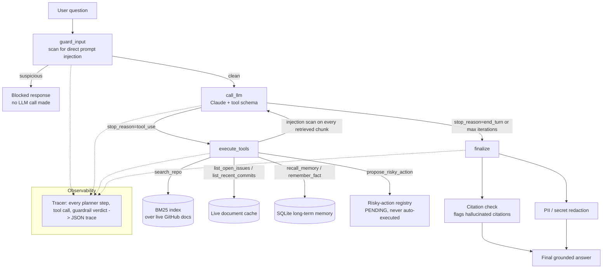

# SentinelRAG

Agentic retrieval-augmented generation over a live GitHub repository, with cross-session memory, guardrails against prompt injection, and a CI-gated evaluation suite.

[](https://github.com/AbhishekAdurti2000/sentinelrag/actions/workflows/ci.yml)

## The problem

Retrieval-augmented generation is usually demonstrated against a static, trusted corpus: a handful of PDFs the developer picked, indexed once, and never touched again. That setup sidesteps three problems that show up the moment you point a RAG system at something real:

1. **The data changes.** A repository's issues, pull requests, and commits are being written by other people right now. A system that answers from a snapshot gives stale answers by design.
2. **The data isn't trusted.** Anyone can open an issue on a public repository. If a retrieval system feeds issue bodies straight into a language model's context, it has built an injection vector — an attacker doesn't need to compromise the model, only word an issue carefully.
3. **Correctness isn't measured, it's asserted.** "The model cites its sources" and "the guardrails catch injection" are both claims that are easy to make and rarely tested against anything. Without a labeled dataset and a number, they're not verified — they're vibes.

SentinelRAG is a working answer to all three: it retrieves from a repository's live state, treats every piece of retrieved evidence as untrusted input, and ships with a deterministic evaluation suite that puts a number on each guardrail and fails a CI build if that number regresses.

## What it does

Point it at any public GitHub repository and ask questions like *"what changed in the last week, and does anything look like a blocker?"* The system:

- Fetches live issues, pull requests, and commits from the GitHub REST API (falling back to the last good cache if the API is unreachable or rate-limited, rather than failing outright).
- Plans its own sequence of tool calls — search the repo, list open issues, check recent commits, recall a fact from a previous session — rather than doing one fixed retrieve-then-generate pass.
- Cites every claim against a specific issue, pull request, or commit, and mechanically verifies after generation that every citation actually corresponds to evidence it was given, rather than trusting the model's output.
- Treats retrieved text as data, never instructions: every chunk of evidence is scanned for injection attempts before it reaches the model, in addition to scanning the user's own query.
- Remembers durable facts across sessions (in SQLite, not in the model's context window), and never executes a write action (closing an issue, merging a PR) without a human confirming it first.
- Logs every step — plan, tool call, guardrail verdict, final answer — to a structured trace that can be replayed.

## Architecture



The loop is a real cycle, not a straight line. The model decides for itself how many tool calls it needs — search issues, then commits, then check memory — before it has enough evidence to answer, bounded by a hard iteration cap so a confused model can't loop forever.

### Components

| Concern | Where | Notes |
|---|---|---|
| Live data | `sentinelrag/connectors/github.py` | Refreshes from the GitHub REST API on demand; falls back to the last good cache on rate limit or network failure instead of crashing the pipeline. |
| Retrieval | `sentinelrag/retrieval/` | BM25 lexical search, with three interchangeable chunking strategies measured against each other rather than one assumed to be best. |
| Memory | `sentinelrag/memory/store.py` | SQLite, one row per `(repo, key)`, upserted in place — durable facts persist across sessions without unbounded growth. |
| Orchestration | `sentinelrag/agents/graph.py` | A LangGraph state machine: `guard_input → call_llm ⇄ execute_tools → finalize`. |
| Tools | `sentinelrag/tools/repo_tools.py` | `search_repo`, `list_open_issues`, `list_recent_commits`, `recall_memory`, `remember_fact`, `propose_risky_action`. |
| Guardrails | `sentinelrag/guardrails/` | Injection detection (direct and indirect), citation verification, PII/secret redaction, and a risky-action gate requiring human confirmation. |
| Observability | `sentinelrag/tracing/tracer.py` | Every step logged to a structured JSON trace; `scripts/view_trace.py` renders it. |
| Evaluation | `evals/` | Deterministic guardrail and retrieval evals (CI-gated, no API key required) plus an optional live end-to-end eval against the real API. |

## Guardrails

- **Direct prompt injection.** The user's own query is scanned before it reaches the model. A match short-circuits the graph entirely — the LLM is never called.
- **Indirect prompt injection.** Every chunk of retrieved evidence is scanned too, because on a public repository anyone can open an issue, and an issue body is exactly where an attacker would plant "ignore previous instructions." The system prompt also tells the model explicitly that tool results are untrusted data, never instructions — defense in depth rather than a single layer.
- **Citation verification.** The model must cite `[issue:N]`, `[pull_request:N]`, or `[commit:sha]` for every claim. After generation, every citation is checked mechanically against the evidence the model actually received from its tool calls; anything else is flagged as hallucinated.
- **PII and secret redaction.** The final answer is scanned for emails, GitHub tokens, AWS keys, generic API keys, phone numbers, and IP addresses before it's returned, since verbatim-quoted issue text can legitimately contain these.
- **Risky-action confirmation.** The agent can propose a write action (closing an issue, merging a pull request) but never executes one. Proposals sit in a registry with `PENDING` status until a human explicitly confirms them — enforced as a code boundary, not a prompt instruction that an injected issue body could try to talk the model out of.
- **Hard iteration cap.** The tool-calling loop is bounded regardless of what the model wants to do next; a test proves this holds even when the model is scripted to request tools indefinitely.

## Results

These numbers come from `evals/run_deterministic_evals.py`, run against the labeled datasets in `evals/datasets/`. It takes under a second and needs no API key — clone the repo and run it yourself.

| Metric | Result | Dataset |
|---|---|---|
| Prompt injection detection (precision / recall / F1) | 0.889 / 1.000 / 0.941 | 18 labeled examples, direct and indirect, including adversarial issue bodies |
| PII/secret redaction, category recall | 1.00 | 8 labeled examples across 6 categories |
| Citation-hallucination detection accuracy | 1.00 | 5 labeled answer/evidence pairs |
| Retrieval hit-rate@1, whole-document chunking | 0.958 | 24 QA pairs over a 20-document synthetic repository |
| Retrieval hit-rate@1, fixed-400-character chunking | 0.917 | same 24 QA pairs |

The last two rows are a direct comparison, not an assumption: on issues where the answer is buried a few hundred characters into a long body rather than in the title, splitting text into fixed 400-character windows loses about four points of hit-rate@1 relative to keeping each issue, pull request, or commit whole, because the answer-bearing sentence sometimes lands in the wrong chunk. At top-3 rather than top-1, all three chunking strategies saturate to 1.00 on a corpus this size — worth knowing before assuming a larger top-k hides this difference at any scale.

Test suite: 37 tests, 100% passing, 93% line coverage of the testable surface. (`sentinelrag/cli.py`'s interactive loop and the live Anthropic API adapter are excluded from coverage by design — they're exercised against a real key, not mocked.)

An optional end-to-end evaluation against the real API and a real live repository (`evals/run_live_eval.py`) is documented below. It isn't run in CI, since it needs `ANTHROPIC_API_KEY`, network access, and consumes tokens — but it's one command to run locally.

## What live testing caught

The deterministic and mocked test suite is necessary but not sufficient — it can only be as good as the scenarios it thinks to mock. Running the agent against a real repository (`langchain-ai/langgraph`) for the first time surfaced a bug that 36 passing unit tests had missed entirely: citation tracking only recognized evidence returned by the `search_repo` tool, keyed on one specific field name in its output. Every test happened to route through `search_repo`, so every test passed. The live agent, reasonably, chose `list_recent_commits` and `list_open_issues` for a "what changed recently" question instead — and every citation it produced was incorrectly flagged as hallucinated, a false positive in the guardrail itself.

The fix generalizes citation harvesting to any tool's output rather than one hardcoded key, with a regression test (`test_citations_from_non_search_tools_are_not_flagged_as_hallucinated`) added to cover it. The broader point: a fully mocked test suite reporting green tells you the code runs the paths you wrote tests for. It doesn't tell you those paths are the ones that matter until something exercises the system for real.

## Getting started

```bash
git clone https://github.com/AbhishekAdurti2000/sentinelrag.git
cd sentinelrag
python3 -m venv .venv
source .venv/bin/activate
pip install -r requirements.txt

cp .env.example .env
# Set ANTHROPIC_API_KEY (required to run the agent).
# GITHUB_TOKEN is optional; it raises the GitHub API rate limit from 60/hr to 5000/hr.
```

Run the test and evaluation suite (no API key required):

```bash
pytest tests/ -v
python evals/run_deterministic_evals.py
```

Ask the live agent about a real repository:

```bash
python -m sentinelrag.cli --repo langchain-ai/langgraph "What changed recently, and are there any open blockers?"
```

Run the optional end-to-end evaluation against the real API:

```bash
python evals/run_live_eval.py --repo langchain-ai/langgraph
```

Inspect exactly what the agent did on any run:

```bash
python scripts/view_trace.py data/traces/<run_id>.json
```

## Continuous integration

`.github/workflows/ci.yml` runs on every push and pull request to `main`:

1. Installs dependencies and runs all unit tests with coverage.
2. Runs the deterministic evaluation suite and fails the build if any headline metric — injection F1, PII recall, citation accuracy, or retrieval hit-rate — drops below 0.75.
3. Uploads the evaluation results as a build artifact and writes them into the job summary.

No secrets are required for any of this, which is the reason deterministic, mockable-LLM evaluation is kept separate from the optional live end-to-end evaluation.

## Design decisions

**BM25 instead of dense embeddings.** The retrieval pipeline runs offline, deterministically, and at no cost — cloning the repository and running the evaluation suite requires no API key and no external service. The trade-off is real: BM25 is lexical, so a paraphrased query sharing no vocabulary with the evidence will miss. The retrieval layer is isolated behind a single `BM25Index` class specifically so a dense or hybrid retriever can be swapped in without touching the orchestration graph.

**A minimal custom tracer instead of a hosted observability platform.** Every event funnels through one `Tracer.log_event()` call, so replacing it with a hosted tracing service later is a one-file change. This keeps the project runnable without an external account while leaving the seam in place for when centralized tracing across multiple runs is actually needed.

**Rule-based injection detection as one layer, not the only layer.** A regex and heuristic classifier has zero latency and zero cost, is fully unit-testable without an API key, and cannot itself be prompt-injected. It will not catch every creative phrasing of an attack. A model-based classifier as a second layer, evaluated against the same labeled dataset so its marginal benefit is measurable, is listed under future work rather than claimed as already done.

**Multiple narrow tools instead of one general-purpose tool.** `search_repo`, `list_open_issues`, `list_recent_commits`, `recall_memory`, and `remember_fact` are kept separate so the model's plan is legible in the trace: it's possible to see it decide to check open issues, then check whether something was already fixed in a recent commit, as two distinct, inspectable steps rather than one opaque generation.

**A risky-action registry instead of a prompt instruction.** A prompt instruction not to take destructive actions is exactly what an injection attack targets. Making "propose versus execute" a hard boundary in code means even a successful injection can only queue a pending action for a human to review and reject — it can't act on its own.

**Unit tests and evaluations are kept as separate concerns.** Tests, using a scripted fake language-model client, check that the code behaves correctly and require no real model. Evaluations check system quality against labeled data — retrieval hit rate, injection F1, citation accuracy — which is a different question from whether the code runs. Conflating the two is how a project ends up asserting it has guardrails without ever having measured them.

## Roadmap

- Dense or hybrid retrieval alongside BM25, compared head-to-head in the evaluation harness the same way chunking strategies are today.
- A model-based injection classifier as a second guardrail layer, evaluated against the existing labeled dataset so its improvement over the rule-based layer is measured, not assumed.
- A minimal interface for confirming or rejecting pending risky actions, rather than the current direct calls to `RiskyActionRegistry.confirm()` / `.reject()`.
- Expiry on pending risky actions that are never confirmed or rejected.

## License

MIT — see [LICENSE](LICENSE).
